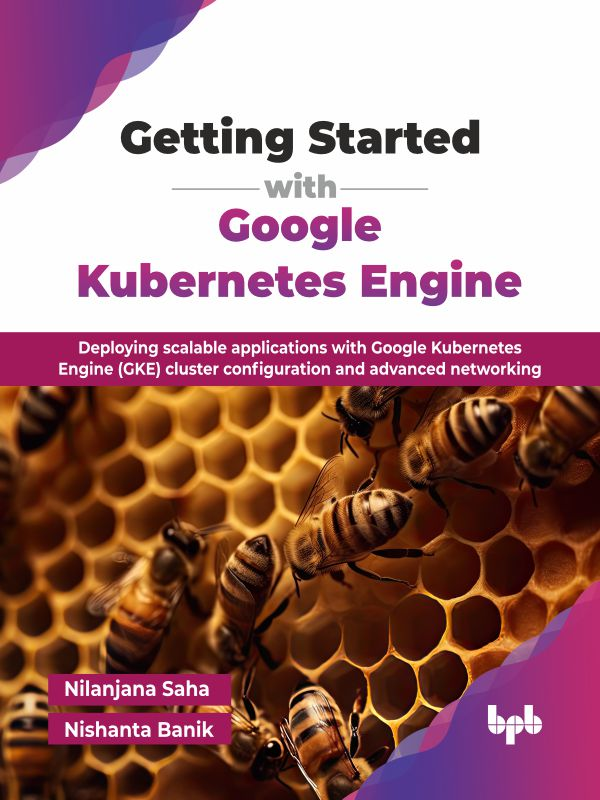

# Getting Started with Google Kubernetes Engine

Deploying scalable applications with Google Kubernetes Engine (GKE) cluster configuration and advanced networking.

This is the repository for [Getting Started with Google Kubernetes Engine
](https://bpbonline.com/products/getting-started-with-google-kubernetes-engine?variant=44591156691144),published by BPB Publications.

## About the Book
GKE simplifies deploying and managing containerized applications, a crucial skill in today's cloud-native landscape. This book guides you from foundational concepts to practical implementation, preparing you to effectively use GKE for scalable and reliable deployments.  

The book begins with an introduction to containerization and Kubernetes, laying the groundwork before diving into Google Cloud Platform (GCP) and GKE specifics. You will learn to create and configure GKE clusters, set up your development environment with essential tools like Helm and Argo CD, and deploy applications with scaling and networking configurations. The practical chapters cover monitoring with Prometheus and Grafana, implementing robust security measures, and troubleshooting common GKE issues. Finally, you will explore advanced topics like multi-cluster ingress and service mesh, enabling you to tackle complex deployments.

By the end of this book, you will possess a strong understanding of GKE, capable of confidently deploying, managing, and optimizing containerized applications within Google Cloud. You will gain the skills necessary to leverage GKE's full potential, making you a valuable asset in any cloud-native development team.

## What You Will Learn
• Understand core containerization and Kubernetes concepts, integrating with GCP services.

• Create, configure, and manage GKE clusters using gcloud and Terraform effectively.

• Setup GKE development environments with Helm, Argo CD, and monitoring tools.

• Deploy and scale applications on GKE using YAML, deployments, and services.

• Implement GKE networking principles, including load balancing and DNS configuration.

• Secure GKE clusters, manage secrets, and implement robust security policies.
